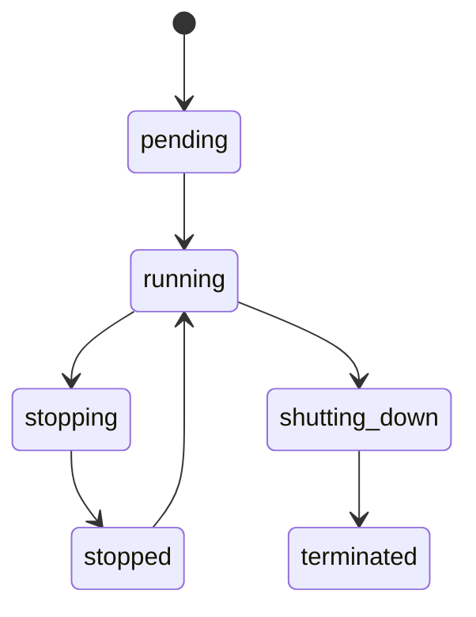

# 🔄 EC2 Instance Lifecycle – Vòng Đời Của EC2

## 1. 🟢 `pending`

- Trạng thái khởi tạo.
- EC2 đang được khởi động dựa trên AMI, instance type, v.v.
- Không tính phí cho đến khi chuyển sang trạng thái `running`.

---

## 2. ✅ `running`

- Instance đã hoạt động và có thể truy cập (qua SSH, public IP, v.v.).
- **Bắt đầu tính phí**.
- Có thể gán Elastic IP, gắn EBS volume, v.v.

---

## 3. ⏸️ `stopping` → 🔴 `stopped`

- Instance đang tắt (gracefully shutdown hệ điều hành).
- Sau khi tắt xong, chuyển sang trạng thái `stopped`.
- **Không tính phí compute**, nhưng **EBS vẫn tính phí**.

### 📌 Trong trạng thái `stopped`, bạn có thể:

- Khởi động lại (start) bất kỳ lúc nào.
- Thay đổi instance type, user data, hoặc gán lại key pair.

---

## 4. 🚫 `shutting-down` → ❌ `terminated`

- Quá trình xóa instance hoàn toàn.
- Sau khi `terminated`, instance **không thể khôi phục lại**.
- **Tất cả dữ liệu trên ổ đĩa tạm (ephemeral)** sẽ bị mất, trừ khi bạn dùng EBS và đã chọn "Keep volume".

---

## 5. 🔁 `rebooting`

- Instance khởi động lại (giống như `sudo reboot` trong Linux).
- **Không thay đổi trạng thái**, vẫn là `running`.
- Không tính là "stop/start", nên IP tạm thời vẫn giữ nguyên.

---

## 📊 Tóm tắt vòng đời

## 🧠 Note:

| Loại EC2                  | Có thể stop? | Dữ liệu giữ lại khi stop | Loại ổ đĩa chính           |
| ------------------------- | ------------ | ------------------------ | -------------------------- |
| **EBS-backed**            | ✅           | ✅                       | Amazon EBS                 |
| **Instance Store-backed** | ❌           | ❌                       | Instance Store (ephemeral) |

📌 Làm sao biết EC2 của bạn dùng loại nào?
Khi tạo EC2, chọn AMI và instance type sẽ quyết định.

Bạn có thể kiểm tra trong phần "Root device type":

- Nếu ghi là ebs → có thể stop.
- Nếu ghi là instance-store → không thể stop.
